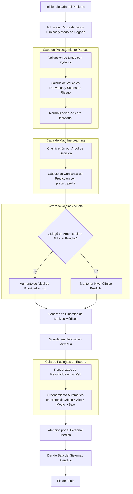

# Flujo de Trabajo del Agente de Triaje Médico 🏥🔄

Este documento describe de forma visual y estructurada el flujo de trabajo completo que realiza la aplicación, desde la admisión del paciente hasta su atención final por parte del personal de guardia.

---

## 📸 Diagrama del Proceso de Triaje
A continuación se presenta un gráfico moderno que ilustra las 4 etapas del flujo de trabajo:

---

## 🗺️ Mapa de Flujo Interactivo (Mermaid)

Para complementar el gráfico anterior, aquí tienes un desglose paso a paso del flujo lógico del sistema:

---

## 📝 Explicación de las Etapas

### 1. Admisión del Paciente
Se capturan sus constantes vitales (frecuencia cardíaca, presión sistólica, saturación de oxígeno, temperatura), datos demográficos y clínicos (edad, dolor, comorbilidades y visitas previas) y el método de llegada.

### 2. Procesamiento e Ingeniería de Datos (Pandas)
Se generan variables e indicadores específicos de riesgo que enriquecen los datos originales, y luego se aplica una normalización Z-score utilizando la media y desviación estándar de la población histórica de entrenamiento.

### 3. Clasificación con Árbol de Decisión (Machine Learning)
El modelo matemático, con una profundidad máxima de 5 niveles, analiza las características procesadas para asignar la clase de urgencia base y calcula la probabilidad estadística (confianza) de dicha asignación.

### 4. Ajuste Clínico y Generación de Diagnóstico
Por cuestiones de seguridad, la aplicación ajusta la severidad si el paciente llegó gravemente incapacitado. Además, compara cada constante vital contra valores ideales para generar una lista comprensible de justificaciones médicas (ej. *"Fiebre elevada detectada"*, *"Saturación menor a 92%"*).

### 5. Cola de Prioridad Inteligente (Historial)
Los pacientes son almacenados dinámicamente y ordenados jerárquicamente en tiempo real de acuerdo con su nivel de urgencia. Esto permite que, sin importar el orden de carga, el equipo de salud siempre vea en la parte superior a los pacientes en estado crítico.
